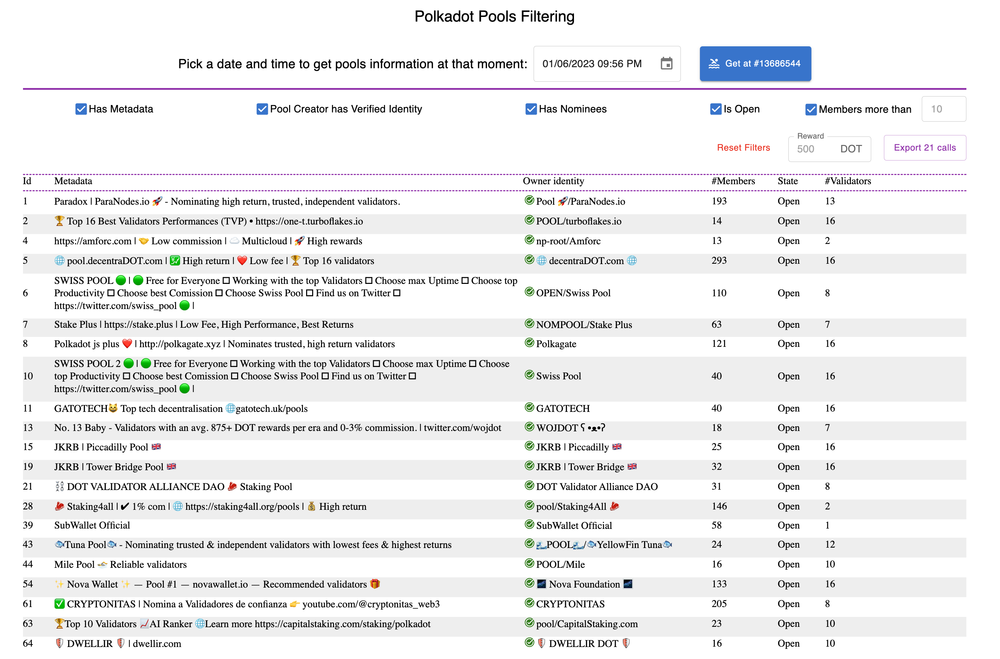

# Getting Started 
This is a single web page to filter polkadot pools based on some filters such as pool members, identity, validators, etc.

# 

## To run
In the project directory, you can run:

### `yarn`
To install the dependencies

### `yarn start`

Runs the app in the development mode.\
Open [http://localhost:3000](http://localhost:3000) to view it in the browser.

### `yarn build`

Builds the app for production to the `build` folder.\
It correctly bundles React in production mode and optimizes the build for the best performance.

The build is minified and the filenames include the hashes.\
Your app is ready to be deployed!